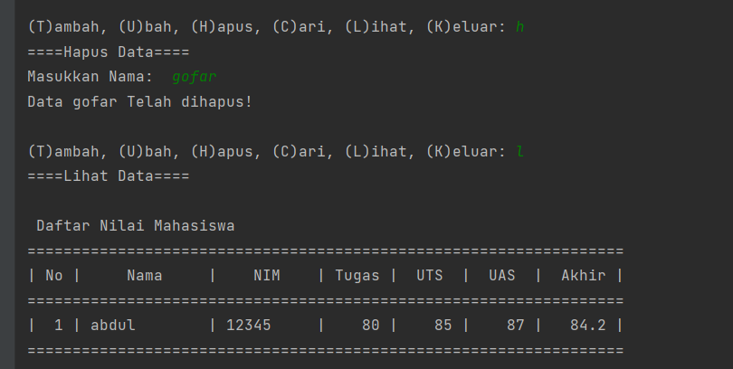

**Nama          : Abdul Gofar**  
**Nim           : 312210504**  
**Kelas         : TI.22.B2**  
**Mata Kuliah   : Bahasa Pemrograman**  
**Program Studi : Teknik Informatika**  
**Dosen Pengampu: Agung Nugroho, M.Kom**  

# Tugas UAS Bahasa Pemrograman

  

## Link video program di Yt
https://youtu.be/uX3F-bNj2vE

## ••Buatalah Package Modul dengan struktur seperti berikut :
√daftar_nilai.py berisi modul untuk:  
tambah_data, ubah_data, hapus_data,
dan cari_data  
✓ view_nilai.py berisi modul untuk:  
cetak_daftar_nilai, cetak_hasil_pencarian  
✓ input_nilai.py berisi modul untuk:  
input_data yang meminta pengguna
memasukkan data.  
✓ main.py berisi program utama (menu
pilihan yang memanggil semua menu
yang ada) 

## •Dibawah ini adalah script untuk daftar_nilai.py
 →Berisi modul untuk : tambah_data, ubah_data, hapus_data, dan cari_data  

from View.input_nilai import   

data = {}  

def tambah_data():  
    print("====Tambah Data====")  
    global data  
    nama = input_nama()  
    nim = input_nim()  
    nilaiTugas = input_nilaiTugas()  
    nilaiUts = input_nilaiUts()  
    nilaiUas = input_nilaiUas()  
    nilaiAkhir = (0.30 * nilaiTugas) + (0.35 * nilaiUts) + (0.35 * nilaiUas)  
    data[nama] = nim, nilaiTugas, nilaiUts, nilaiUas, nilaiAkhir  
    print("\nData Berhasil Ditambahkan!")  
    return data  

def ubah_data():  
    print("====Ubah Data====")  
    nama = input("Masukkan Nama: ")  
    if nama in data.keys():  
        nim           = input_nim()  
        nilaiTugas    = input_nilaiTugas()  
        nilaiUts      = input_nilaiUts()  
        nilaiUas      = input_nilaiUas()  
        nilaiAkhir    = (0.30 * nilaiTugas) + (0.35 * nilaiUts) + (0.35 * nilaiUas)  
        data[nama]    = nim, nilaiTugas, nilaiUts, nilaiUas, nilaiAkhir  
        print("\nData Berhasil Di Update!")  
    else:  
        print("Data tidak ditemukan!")  

def hapus_data():  
    print("====Hapus Data====")  
    nama = input("Masukkan Nama:  ")  
    if nama in data.keys():  
        del data[nama]  
        print("Data",nama,"Telah dihapus!")  
    else:  
        print("Data Mahasiswa Tidak Ada".format(nama))  

## Gambar inputan
  
  

## •Dibawah ini adalah Script untuk view_nilai.py
 →Berisi modul untuk : cetak_daftar_nilai, cetak_hasil_pencarian  

 from model.daftar_nilai import   

def cetak_daftar_nilai(): 
    print("====Lihat Data====") 
    if data.items(): 
        print("\n Daftar Nilai Mahasiswa ") 
        print("==================================================================") 
        print("| No |     Nama     |    NIM    | Tugas |  UTS  |  UAS  |  Akhir |") 
        print("==================================================================") 
        i = 0 
        for x in data.items(): 
            i += 1 
            print("| {6:2} | {0:12s} | {1:9s} | {2:5} | {3:5} | {4:5} | {5:6} |".format(x[0], x[1][0], x[1][1], x[1][2], 
                                                                                        x[1][3], x[1][4], i)) 
        print("==================================================================") 
    else: 
        print("\n Daftar Nilai Mahasiswa ") 
        print("==================================================================") 
        print("| No |     Nama     |    NIM    | Tugas |  UTS  |  UAS  |  Akhir |") 
        print("==================================================================") 
        print("|                          TIDAK ADA DATA                        |") 
        print("==================================================================") 

def cetak_hasil_pencarian(): 
    print("====Cari Data====") 
    nama = input("Masukkan Nama        : ") 
    if nama in data.keys(): 
        print("\n Daftar Nilai Mahasiswa ") 
        print("==============================================================") 
        print("|     Nama     |    NIM    | Tugas |  UTS  |  UAS  |  Akhir  |") 
        print("==============================================================") 
        print("| {0:12s} | {1:9s} | {2:5} | {3:5} | {4:5} | {5:6}  |" 
              .format(nama, data[nama][0], data[nama][1],data[nama][2], data[nama][3],data[nama][4])) 
        print("==============================================================") 
    else: 
        print("Data {0} Tidak Ada ".format(nama)) 

## Gambar inputan
  
  

## •Dibawah ini adalah Script untuk input_nilai.py
 →Berisi modul untuk : input_data yang meminta pengguna untuk memasukan data 

def input_nama(): 
    global nama 
    nama = input("Masukkan Nama anda        : ") 
    return nama 

def input_nim(): 
    global nim 
    nim = input("Masukkan NIM  anda         : ") 
    return nim 

def input_nilaiTugas(): 
    global nilaiTugas 
    nilaiTugas = int(input("Masukkan Nilai Tugas : ")) 
    return nilaiTugas 

def input_nilaiUts(): 
    global nilaiUts 
    nilaiUts = int(input("Masukkan Nilai UTS   : ")) 
    return nilaiUts 

def input_nilaiUas(): 
    global nilaiUas 
    nilaiUas = int(input("Masukkan Nilai UAS   : ")) 
    return nilaiUas 

## Gambar inputan
  

## •Dibawah ini adalah script untuk main.py
 →Berisi program utama (menu pilihan yang memanggil semua menu yang ada) 

from View.view_nilai import * 

while True: 
    c = input("\n(T)ambah, (U)bah, (H)apus, (C)ari, (L)ihat, (K)eluar: ") 

    if (c.lower() == 't'): 
        tambah_data()

    elif (c.lower() == 'u'):
        ubah_data()

    elif (c.lower() == 'h'):
        hapus_data()

    elif (c.lower() == 'c'):
        cetak_hasil_pencarian()

    elif (c.lower() == 'l'):
        cetak_daftar_nilai()

    elif (c.lower() == 'k'):
        break

    else: 
        print("=== Pilih Sesuai Menu Yang Tersedia ===")

## Gambar inputan
  

## Berikut adalah hasil output programnya
• Dibawah ini adalah hasil program ketika input data dan menambahkan data
  

• Dibawah ini adalah hasil program menampilkan data dan mencari data
  

• Dibawah ini adalah hasil program ubah data
  

• Dibawah ini adalah hasil program hapus data
  

## Selesai
### Sekian dan Terimakasih semoga membantu 🙏😊
